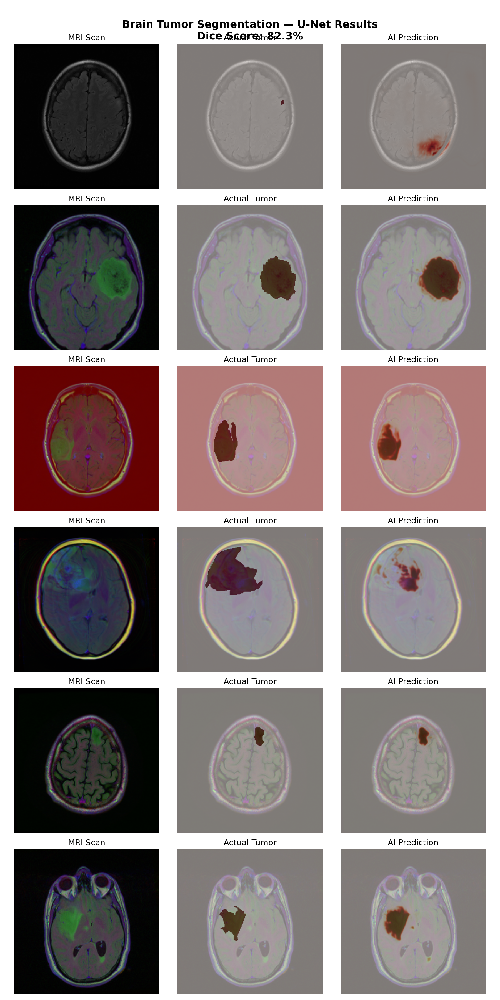
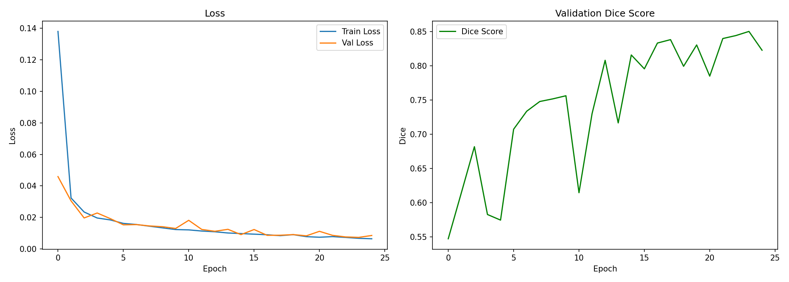

# brain-tumor-segmentation

Deep learning model that automatically detects and segments brain tumors from MRI scans using a U-Net architecture.

## Results

**Dice Score: 82.3%**

### Predictions


### Training Curves


## Overview
| Detail | Value |
|--------|-------|
| Model | U-Net |
| Dataset | 3,929 MRI scans from 113 patients |
| Dice Score | 82.3% |
| Validation Loss | 0.0086 |
| Epochs | 25 |
| Parameters | ~31 million |
| GPU | NVIDIA T4 (Google Colab) |

## Architecture

U-Net encoder-decoder with skip connections:


- **Encoder:** Conv2d → BatchNorm → ReLU → MaxPool (x4)
- **Bottleneck:** 1024-channel feature representation
- **Decoder:** ConvTranspose2d → Skip Connection → Conv2d (x4)
- **Output:** Sigmoid activation (per-pixel tumor probability)

## Dataset

[LGG MRI Segmentation Dataset](https://www.kaggle.com/datasets/mateuszbuda/lgg-mri-segmentation) from The Cancer Imaging Archive (TCIA). Contains brain MRI images with manual FLAIR abnormality segmentation masks.

## How To Run

```bash
pip install torch torchvision numpy matplotlib Pillow tqdm

python train.py      # Train the model
python predict.py    # Visualize predictions

├── dataset.py       # Custom PyTorch Dataset for MRI loading
├── model.py         # U-Net architecture implementation
├── train.py         # Training loop with validation and metrics
├── predict.py       # Inference and visualization
├── predictions.png  # Sample results
└── training_curves.png  # Loss and Dice score plots
